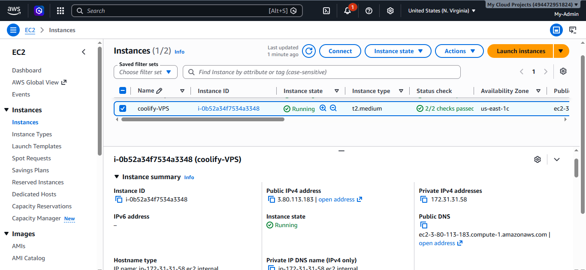
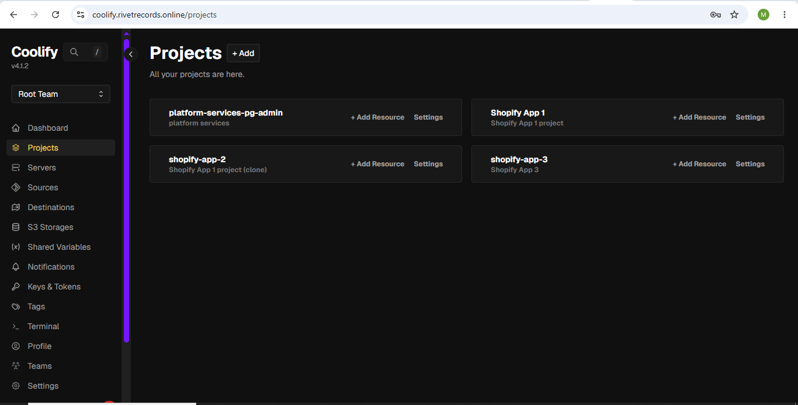
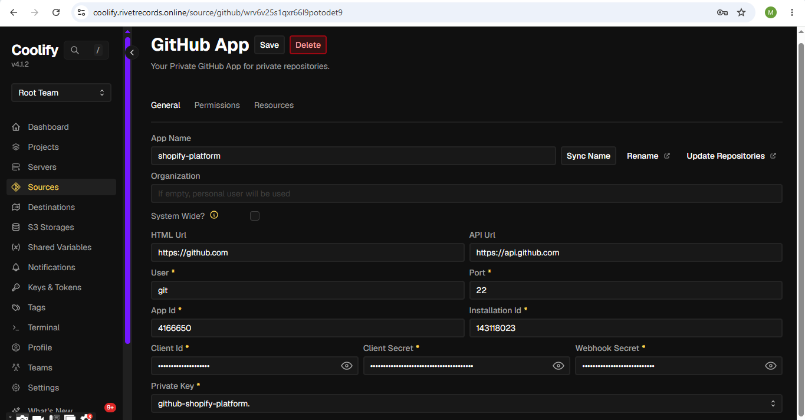
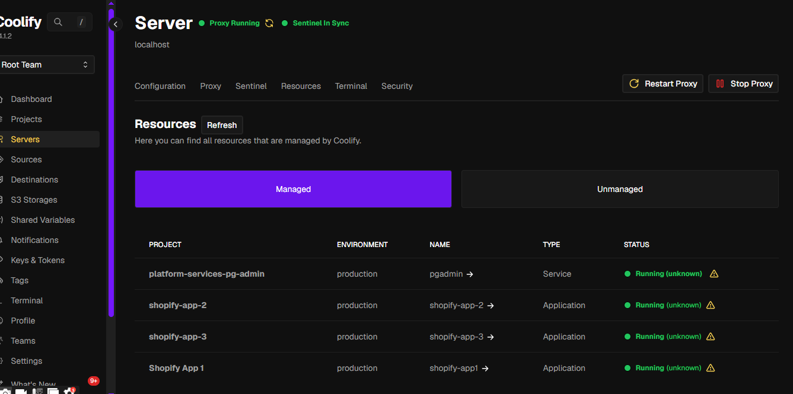
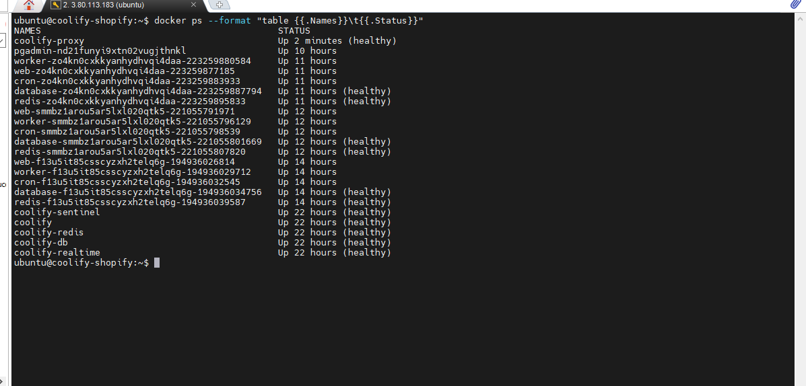
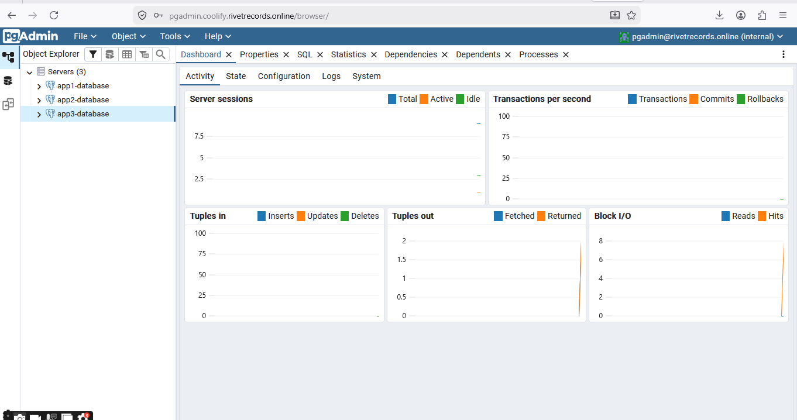
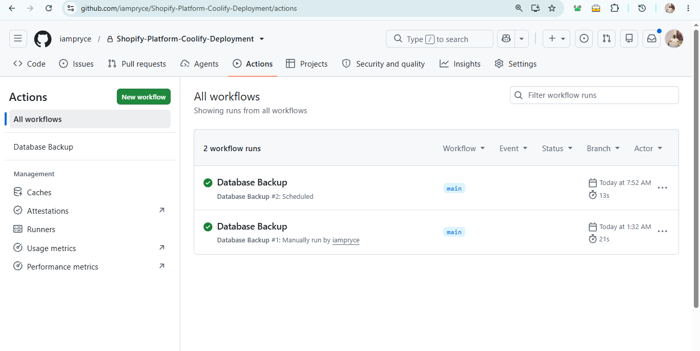
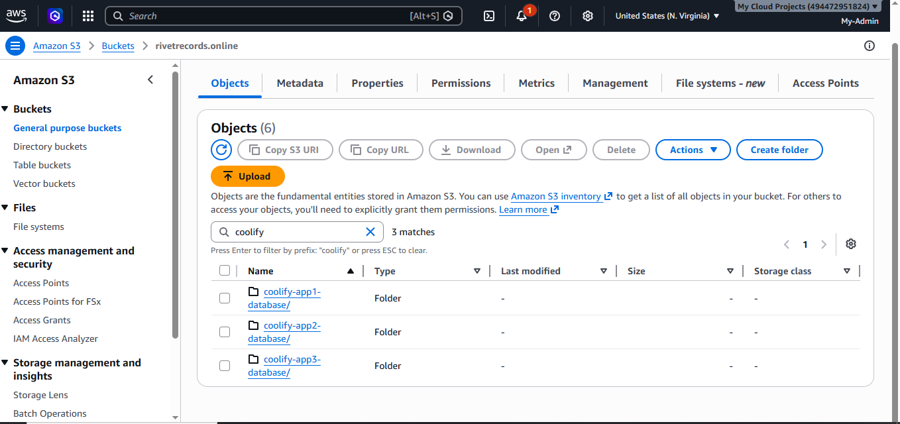

# Shopify Platform Deployment using Coolify, Docker, and AWS EC2


## Project Overview

This project demonstrates the deployment of a production-ready Shopify platform on AWS EC2 using Coolify as the deployment platform. Three independent Shopify applications are deployed, each in its own Coolify project with a complete production stack including a background worker, cron job scheduler, dedicated PostgreSQL database, and Redis instance.

The platform deploys directly from GitHub without an intermediate container registry. Coolify builds Docker images on the server, manages SSL certificates, handles reverse proxy routing, and provides centralised deployment management from a single dashboard.

---

# Project Objectives

* Provision and secure an AWS EC2 Ubuntu 24.04 LTS instance
* Install and configure Coolify as the deployment platform
* Connect Coolify to GitHub for direct source deployments
* Deploy three independent React Router v7 Shopify applications
* Provision independent PostgreSQL databases and Redis instances per application
* Deploy background workers and cron job schedulers per application
* Configure Traefik reverse proxy with HTTPS via Let's Encrypt
* Deploy pgAdmin for centralised database administration
* Automate daily database backups to AWS S3 via GitHub Actions
* Validate a complete production deployment workflow end-to-end


# Architecture


---


# Deployment Workflow

```text
Developer
      │
      ▼
Git Push to GitHub
      │
      ▼
GitHub App Webhook
      │
      ▼
Coolify detects push
      │
      ▼
Builds Docker images on EC2
(web / worker / cron)
      │
      ▼
Deploys all 5 services per project
      │
      ▼
Prisma migration runs on startup
      │
      ▼
Traefik routes HTTPS traffic
      │
      ▼
Shopify Platform
(OAuth • Admin API • Webhooks)

---

GitHub Actions (scheduled daily)
      │
      ▼
SSH into EC2
      │
      ▼
pg_dump each database
      │
      ▼
Upload to AWS S3
```

---

# Platform Engineering Decisions

## AWS EC2

A self-managed Ubuntu EC2 instance provides complete administrative control over the deployment environment. The instance runs Coolify, all three application stacks, pgAdmin, and the Traefik reverse proxy from a single server.

---

## Coolify

Coolify serves as the centralised deployment platform. It connects directly to GitHub via a GitHub App, builds Docker images on the server without requiring an external container registry, manages SSL certificates via Let's Encrypt through Traefik, and provides per-project isolation for all three application stacks.

---

## Direct GitHub Deployment

Coolify pulls source code directly from GitHub and builds images on the deployment server. This eliminates Docker Hub as a dependency and simplifies the deployment pipeline.

---

## Per-Project Isolation

Each Shopify application is deployed as a separate Coolify project with its own Docker network. Services within a project communicate over the internal network. Projects are isolated from each other by default, providing security boundaries between applications.

---

## Redis and BullMQ

Each application stack includes a dedicated Redis instance used as a job queue via BullMQ. The cron service schedules recurring tasks and adds jobs to the queue. The worker service processes jobs from the queue asynchronously, decoupling background work from the web request lifecycle.

---

## Traefik Reverse Proxy

Coolify manages Traefik automatically. Traefik terminates HTTPS connections, provisions Let's Encrypt SSL certificates, and routes traffic to the correct application container based on the requested domain.

---

## GitHub Actions for Backups

Daily database backups are orchestrated via a GitHub Actions scheduled workflow. The workflow SSHes into the EC2 instance and runs `pg_dump` inside each database container, piping the compressed output directly to AWS S3. No backup script is stored on the server — all logic lives in the repository.

---

# Project Execution

## Phase 1: Provision AWS EC2 Instance

Configure and secure a clean Ubuntu 24.04 LTS EC2 instance on AWS.

### Activities

* Launch Ubuntu 24.04 LTS EC2 instance
* Configure SSH key authentication
* Configure security group inbound rules (ports 22, 80, 443, 3001, 3002, 3003, 8000)
* Update system packages
* Verify network connectivity



---

## Phase 2: Install Coolify

Install Coolify on the provisioned EC2 instance.

### Activities

* Run the Coolify installer
* Verify all Coolify services are running
* Access the Coolify dashboard
* Configure instance domain with HTTPS
* Connect Coolify to GitHub via GitHub App




---


## Phase 3: Deploy Shopify Applications

Create three Coolify projects and deploy each application stack.

### Activities

* Create Coolify project for each app
* Connect project to GitHub repository
* Set Docker Compose file path and base directory per app
* Configure environment variables using Developer view
* Set domain for each web service
* Deploy all three projects
* Verify all 15 containers are running




---

## Phase 4: Validate Live Applications

Confirm all three applications are accessible with valid SSL certificates.

### Activities

* Verify HTTPS endpoints for all three apps
* Validate Shopify OAuth flow
* Confirm Prisma migrations applied on startup
* Verify session written to PostgreSQL after OAuth

### Platform URLs

* `https://app1.coolify.rivetrecords.online` — Shopify App 1
* `https://app2.coolify.rivetrecords.online` — Shopify App 2
* `https://app3.coolify.rivetrecords.online` — Shopify App 3
* `https://pgadmin.coolify.rivetrecords.online` — pgAdmin
* `https://coolify.rivetrecords.online` — Coolify Dashboard


---

## Phase 5: Deploy pgAdmin

Deploy pgAdmin for centralised database administration across all three application databases.

### Activities

* Create Platform Services project in Coolify
* Deploy pgAdmin as a Service Stack
* Configure domain `pgadmin.coolify.rivetrecords.online`
* Connect pgAdmin container to all three app Docker networks
* Add all three databases as servers in pgAdmin



---

## Phase 6: Configure Automated Backups

Automate daily PostgreSQL backups to AWS S3 using a GitHub Actions scheduled workflow.

### Activities

* Install AWS CLI on EC2 instance
* Configure AWS credentials on EC2
* Add SSH secrets to GitHub repository
* Create GitHub Actions backup workflow
* Trigger manual backup to validate
* Confirm backup files in S3

The backup workflow is defined in `.github/workflows/backup.yaml`. It runs daily at 2am UTC and can also be triggered manually from GitHub Actions.




---

## Phase 7: Platform Validation


---

# Author

**Oluwatobi Ogundimu**

GitHub: https://github.com/iampryce

LinkedIn: https://www.linkedin.com/in/oluwatobiogundimu-a1341a39b/
